# Тестування працездатності системи
## Запуск серверу
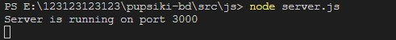

## Метод GET
### GET /
#### Запит
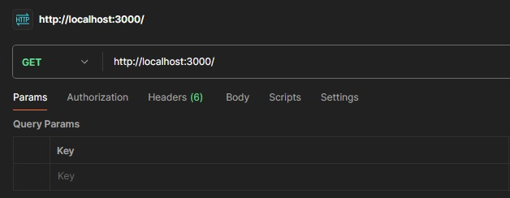
#### Відповідь
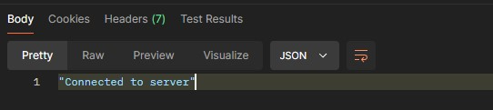

### GET /USER
#### Запит
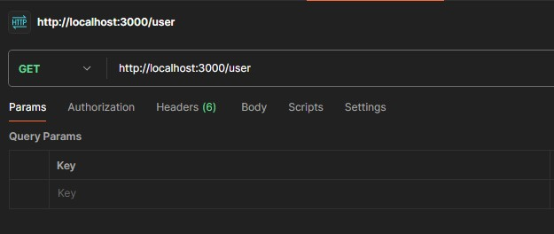
#### Відповідь
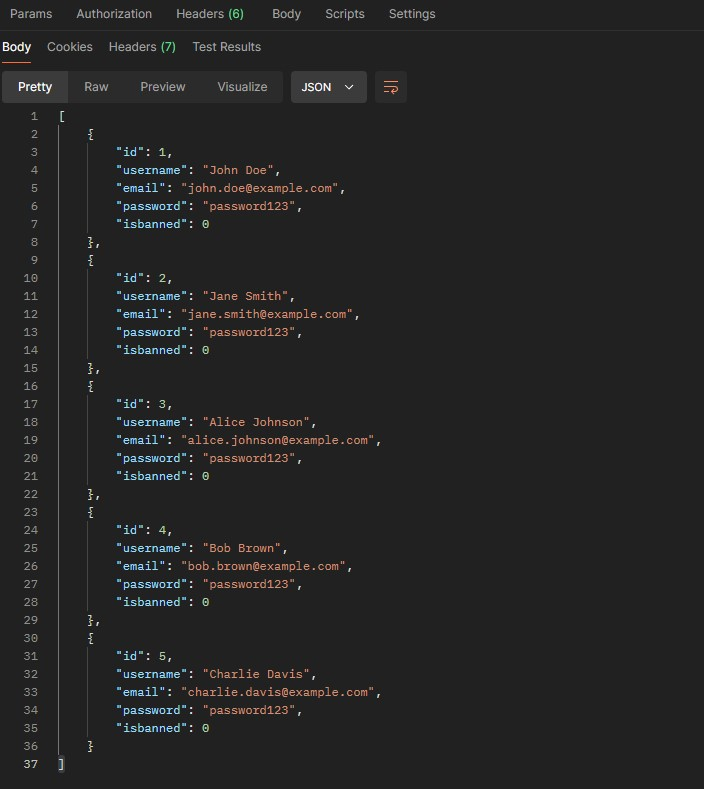

### GET /USER/:ID
#### Запит (Існуючий користувач)
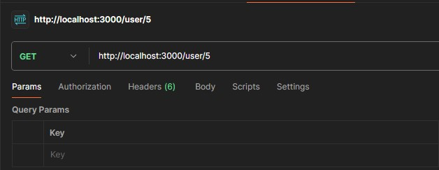
#### Відповідь
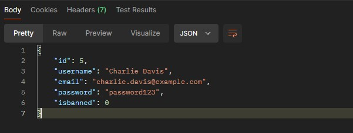

#### Запит (Не існуючий користувач)
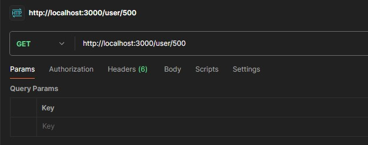
#### Відповідь
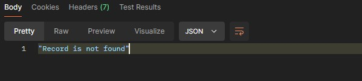

## Метод POST
#### Запит 
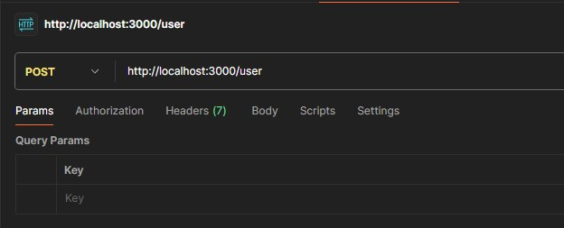
#### Відповідь

## Метод PATCH
#### Запит 
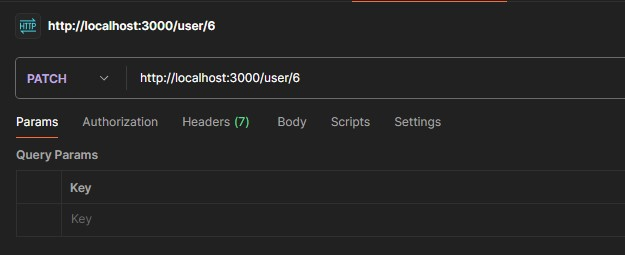
#### Відповідь
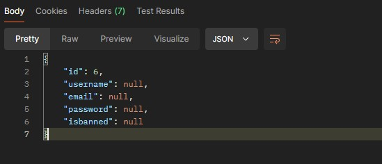

## Метод DELETE
#### Запит 
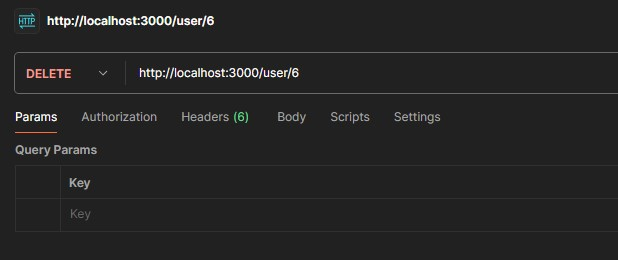
#### Відповідь
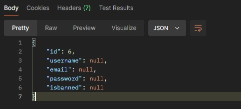
